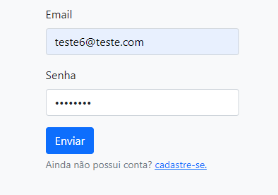
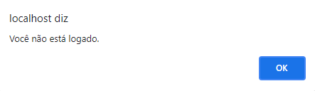

# Login e cadastro de usuários

Este projeto tem como proposito demonstrar uso de PHP + mysql para construir uma aplicação de login e cadastro de usuários.

Como este projeto tem caratér didático, também é possivel ver a lista de usuários cadastrados no sistema acessando a página usuários.

# Inicio

Página principal, contém na parte superior um menu de navegação (presente em todas as páginas) e logo abaixo apresenta a proposta e detalhes do projeto.

# Página de associados

Esta página apresenta o conteúdo para associados, caso não esteja logado, será apresentado o campo para relizar login.

Usuários não cadastrados podem realiza-lo entrando no link abaixo do formulário.

# Cadastro

Formulário destinado ao cadastro de novos usuários.

Ao tentar cadastrar um email que já consta no sistema, será emitido um alerta.

Caso preencha os dados corretamente receberá uma mensagem de êxito.

> Obs: Ao realizar cadastro ou ser avisado da existência do e-mail, será direcionado pra a página de login.

> Obs: Por se tratar de uma projeto didático e estar hospedade em um servidor local, essa aplicação não possui um metódo de confirmação de email.

# Login

Após realizar o cadastro, deve-se efetuar o login para ter acesso a página de associados.

Caso insira dados incorretos receberá um aviso.

Após inserir os dados corretamente ficará disponível o botão de Logout, também receberá a confirmação de login e será direcionado para a página de usuários.

# Usuários

Apresenta a lista de usuários cadastrados.

Caso tente acessar esta página sem estar logado, receberá um aviso e será direcionado para a página de login.

# Logout

Ao clicar no botão de Logout, sua sessão será encerrada e você será direcionado para a página inicial.